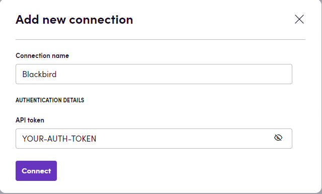

# Blackbird.io Lexeri

Blackbird is the new automation backbone for the language technology industry. Blackbird provides enterprise-scale automation and orchestration with a simple no-code/low-code platform. Blackbird enables ambitious organizations to identify, vet and automate as many processes as possible. Not just localization workflows, but any business and IT process. This repository represents an application that is deployable on Blackbird and usable inside the workflow editor.

## Introduction

Lexeri is a cloud-based terminology management system. Lexeri wants to bring terminology into all departments of your company and tries to achieve this with by focussing on usability and integration. Lexeri offers collaborative terminology workflows and checks for documents and texts in differnt systems. Learn more at [www.lexeri.com](https://www.lexeri.com).

## Connecting

1. Navigate to apps and search for Lexeri. If you cannot find Lexeri then click 'Add App' in the top right corner, select Lexeri and add the app to your Blackbird environment.
2. Click 'Add Connection'.
3. Name your connection for future reference e.g. 'Lexeri connection'.
4. Add an API token (you can create this in the termbase settings of Lexeri in the tab 'API')
5. Click 'Connect'

## Actions

### Term checks

- **Check text** Check text for matching and forbidden terms

## Terms and termbases

- **Search terms** Search terms by term value
- **Export termbase** Export the preferred and admitted terms of the termbase as a tbx file
- **Get termbase info** Get details about the termbase

### Terminology management

- **Create term request** Create a term request that can suggest terms to be added to the termbase.
- **Extract terms from document** Create a new term extraction from a document. The term extraction will be accessible in the task board.
- **Import terms** Import from a tbx, csv or xlsx file. The import will be accessible in the task board for further editing.

## Events

### Terminology management

- **Term request created** - Triggered when a term request was created 
- **Term request finished** - Triggered when processing of a term request was finished and its drafts were published to the termbase
- **Import finished** - Triggered when processing of a import was finished and its drafts were published to the termbase
- **Term extraction finished** - Triggered when processing of a term extractions was finished and its term candidates were published to the termbase
- **Task finished** - Triggered when processing of a terminology task was finished and its drafts were published to the termbase

### Terms
- **Term created** - Triggered when a term was created or updated

## Feedback

Do you want to use this app or do you have feedback on our implementation? Reach out to us using the [established channels](https://www.blackbird.io/) or create an issue.
